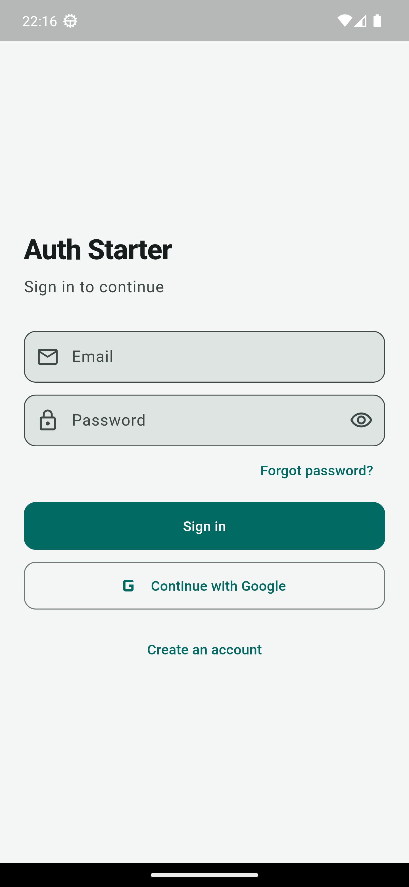
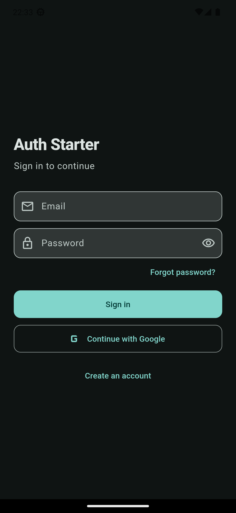
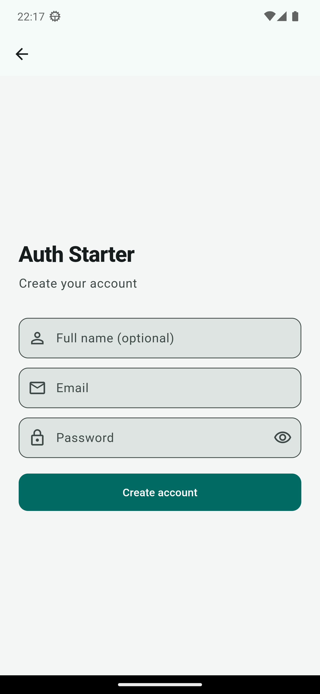

# Flutter + FastAPI Auth Starter

A free **email/password + Google Sign-In** starter with production-ready auth flows, for Flutter apps backed by FastAPI and PostgreSQL.


JWT access + refresh tokens, secure token storage, dark/light themes, form validation, and a one-command backend.

> Interactive API docs: after `docker compose up`, open [http://127.0.0.1:8000/docs](http://127.0.0.1:8000/docs)

---

▶️ **5-minute setup video:** *(coming soon)*

## Screenshots

<!-- Add screenshots to docs/screenshots/ and update the paths below -->

| Login (light) | Login (dark) | Register |
|---------------|--------------|----------|
|  |  |  |

---

## Features

- Email/password **register** & **login**
- **JWT** access (short-lived) + refresh (long-lived)
- Automatic **token refresh** on 401; session cleared if refresh fails
- **Forgot password** endpoint (dev: token printed in API logs)
- **Google Sign-In** (Flutter → backend ID token verify)
- **Riverpod** state, **go_router** routes, **Dio** HTTP, **flutter_secure_storage**
- Dark / light themes from one palette file
- Form validation + clear error messages
- `docker compose up` → PostgreSQL + API

### Fixed package list (do not swap casually)

| Flutter | Backend |
|---------|---------|
| `flutter_riverpod` | `fastapi` |
| `dio` | `sqlalchemy` |
| `flutter_secure_storage` | `passlib[bcrypt]` |
| `google_sign_in` | `python-jose` |
| `go_router` | `psycopg2` (+ uvicorn, pydantic-settings, httpx) |

---

## Quick start

Requires: **Docker Desktop** (running), **Flutter 3.24+**, Git. Ports **8000** and **5432** must be free.

**1. Backend** (first terminal):

```bash
git clone https://github.com/yusufkizilkan/flutter-fastapi-auth-starter.git
cd flutter-fastapi-auth-starter/backend
cp .env.example .env
docker compose up --build
```

Wait for `Application startup complete`, then check [http://127.0.0.1:8000/health](http://127.0.0.1:8000/health) and [http://127.0.0.1:8000/docs](http://127.0.0.1:8000/docs).

> Windows PowerShell: `cp` works as-is (alias of `Copy-Item`).

**2. Flutter app** (second terminal):

```bash
cd flutter-fastapi-auth-starter/app
flutter pub get
flutter run
```

Then: open the app → **Create an account** → sign in.

| Platform | Default API URL |
|----------|-----------------|
| iOS simulator / desktop / web | `http://127.0.0.1:8000` |
| Android emulator | `http://10.0.2.2:8000` (automatic) |
| Physical device | `flutter run --dart-define=API_BASE=http://<YOUR_LAN_IP>:8000` |

### Rebrand without hunting files

- App name / API / Google client ID → `app/lib/core/app_config.dart` (+ `--dart-define`)
- Colors → `app/lib/core/app_theme.dart`
- Backend secrets → `backend/.env`

---

## Google Sign-In setup (step by step)

This is the part most free starters skip. Follow carefully.

### 1) Create a Google Cloud project

1. Open [Google Cloud Console](https://console.cloud.google.com/)
2. Create a project (or select one)
3. **APIs & Services → OAuth consent screen**
   - User type: **External** (for testing)
   - App name, support email → Save
   - Scopes: add `email`, `profile`, `openid` → Save
   - Test users: add your Google account while in Testing

### 2) Create OAuth clients

**APIs & Services → Credentials → Create credentials → OAuth client ID**

Create **both**:

#### A) Web application (required — this is `serverClientId` / backend audience)

1. Application type: **Web application**
2. Name: e.g. `Auth Starter Web`
3. Copy the **Client ID** (looks like `xxxxx.apps.googleusercontent.com`)

Put it in:

```env
# backend/.env
GOOGLE_CLIENT_ID=xxxxx.apps.googleusercontent.com
```

And when running Flutter:

```bash
flutter run --dart-define=GOOGLE_CLIENT_ID=xxxxx.apps.googleusercontent.com
```

#### B) Android client

1. Application type: **Android**
2. Package name: `com.authstarter.auth_starter` (see `app/android/app/build.gradle`)
3. SHA-1: get debug fingerprint:

```bash
# Windows (typical debug keystore)
keytool -list -v -alias androiddebugkey -keystore %USERPROFILE%\.android\debug.keystore -storepass android -keypass android
```

```bash
# macOS / Linux
keytool -list -v -alias androiddebugkey -keystore ~/.android/debug.keystore -storepass android -keypass android
```

Copy the **SHA1** line into the Android OAuth client.

### 3) (Optional) Firebase / google-services.json

If you use Firebase Android setup:

1. Firebase Console → Add Android app with the same package name + SHA-1
2. Download `google-services.json`
3. Place it at `app/android/app/google-services.json`
4. Ensure the Google Services Gradle plugin is applied (Firebase docs)

For many apps, **Web + Android OAuth clients alone** are enough for `google_sign_in` if `serverClientId` (Web client ID) is set.

### 4) iOS (optional)

1. Create an **iOS** OAuth client with your iOS bundle ID (`com.authstarter.authStarter` by default)
2. Add the reversed client ID URL scheme to `Info.plist` (Google Sign-In iOS docs)

### 5) Verify

1. Restart API (`docker compose up`) so `GOOGLE_CLIENT_ID` is loaded
2. `flutter run --dart-define=GOOGLE_CLIENT_ID=...`
3. Tap **Continue with Google** → account picker → you land on the home screen
4. `GET /auth/me` in `/docs` with the access token confirms the user

**Common failures**

| Symptom | Fix |
|---------|-----|
| `Missing Google ID token` | Web client ID not passed as `serverClientId` / `GOOGLE_CLIENT_ID` |
| `Google client ID mismatch` | Backend `.env` Web client ID ≠ Flutter dart-define |
| Android cancel / ApiException 10 | Wrong package name or SHA-1 |
| Works once then fails | Consent screen still in Testing; add the Google account as test user |

---

## Folder structure

```
flutter-fastapi-auth-starter/
├── app/                          # Flutter
│   └── lib/
│       ├── core/                 # theme, config, api client, storage, router
│       ├── features/auth/
│       │   ├── data/             # models, API, repository
│       │   ├── providers/        # Riverpod
│       │   └── ui/               # login, register, forgot, auth_gate, home
│       └── main.dart
├── backend/
│   ├── app/
│   │   ├── routers/auth.py       # /auth/*
│   │   ├── models.py             # SQLAlchemy User
│   │   ├── security.py           # JWT + bcrypt
│   │   └── main.py
│   ├── Dockerfile
│   ├── docker-compose.yml
│   └── .env.example
└── README.md
```

### Auth API

| Method | Path | Notes |
|--------|------|--------|
| POST | `/auth/register` | email, password, optional full_name |
| POST | `/auth/login` | returns access + refresh |
| POST | `/auth/refresh` | rotate tokens |
| POST | `/auth/forgot-password` | always same message; token logged in API |
| GET | `/auth/me` | Bearer access token |
| POST | `/auth/google` | `{ "id_token": "..." }` |

---

## What's next?

This starter is the foundation of a full SaaS kit I'm building — subscriptions (RevenueCat), push notifications, Apple Sign-In, profile management and an admin panel.

<!-- TODO: replace with the Gumroad product URL once it's live -->
Want to know when it ships? → **Join the waitlist** *(link coming soon)*

Found this useful? A ⭐ helps more developers discover it.

---

## FAQ

**Is this production-ready?**  
The auth *flows* are production-ready (hashing, JWT types, refresh, secure storage). Before real traffic: change `SECRET_KEY`, lock CORS, send real reset emails, rate-limit auth routes, and run HTTPS.

**Why does forgot-password not send email?**  
Starters shouldn’t force an SMTP vendor. The endpoint is wired; the reset token is printed in the API log for local testing. Hook SendGrid/Resend/Mailgun in one place.

**`docker compose up` fails with a port error**  
Something else is using port 8000 or 5432 (a local PostgreSQL install is the usual suspect). Stop it, or change the host port mapping in `backend/docker-compose.yml`.

**Can I use SQLite instead of Postgres?**  
This repo is intentionally Postgres + Compose (one-command demo). Swapping engines is possible via SQLAlchemy URL changes, but not the default path.

**Where do I change brand colors?**  
`app/lib/core/app_theme.dart` — `seed`, `lightBg`, `darkBg`.

**Docker isn’t installed**  
Install [Docker Desktop](https://www.docker.com/products/docker-desktop/), start it, then `docker compose up --build` from `backend/`.

**Android build fails with a shader / "Could not write file" error on Windows**  
If your project path contains non-ASCII characters (e.g. `Masaüstü`, `Büro`), Flutter's shader compiler can fail. Map the app folder to a drive letter and build from there:

```powershell
subst Y: "C:\path\to\flutter-fastapi-auth-starter\app"
cd Y:\
flutter run
```

(`android.overridePathCheck=true` is already set in `gradle.properties` for the Gradle side.)

---

## License

MIT — use it in commercial apps. Attribution appreciated, not required.
